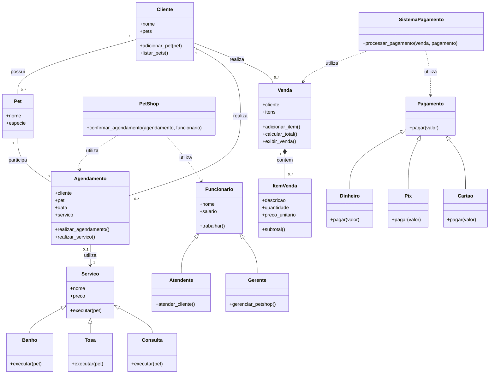

```mermaid
classDiagram
    class Cliente {
        +nome
        +pets
        +adicionar_pet(pet)
        +listar_pets()
    }

    class Pet {
        +nome
        +especie
    }

    class Funcionario {
        +nome
        +salario
        +trabalhar()
    }

    class Atendente {
        +atender_cliente()
    }

    class Gerente {
        +gerenciar_petshop()
    }

    class Servico {
        +nome
        +preco
        +executar(pet)
    }

    class Banho {
        +executar(pet)
    }

    class Tosa {
        +executar(pet)
    }

    class Consulta {
        +executar(pet)
    }

    class Agendamento {
        +cliente
        +pet
        +data
        +servico
        +realizar_agendamento()
        +realizar_servico()
    }

    class PetShop {
        +confirmar_agendamento(agendamento, funcionario)
    }

    class Venda {
        +cliente
        +itens
        +adicionar_item()
        +calcular_total()
        +exibir_venda()
    }

    class ItemVenda {
        +descricao
        +quantidade
        +preco_unitario
        +subtotal()
    }

    class Pagamento {
        +pagar(valor)
    }

    class Dinheiro {
        +pagar(valor)
    }

    class Pix {
        +pagar(valor)
    }

    class Cartao {
        +pagar(valor)
    }

    class SistemaPagamento {
        +processar_pagamento(venda, pagamento)
    }

    Funcionario <|-- Atendente
    Funcionario <|-- Gerente

    Servico <|-- Banho
    Servico <|-- Tosa
    Servico <|-- Consulta

    Pagamento <|-- Dinheiro
    Pagamento <|-- Pix
    Pagamento <|-- Cartao

    Cliente "1" -- "0..*" Pet : possui
    Cliente "1" -- "0..*" Agendamento : realiza
    Pet "1" -- "0..*" Agendamento : participa
    Agendamento "0..1" --> "1" Servico : utiliza

    Cliente "1" -- "0..*" Venda : realiza
    Venda "1" *-- "0..*" ItemVenda : contem

    PetShop ..> Agendamento : utiliza
    PetShop ..> Funcionario : utiliza

    SistemaPagamento ..> Venda : utiliza
    SistemaPagamento ..> Pagamento : utiliza
```